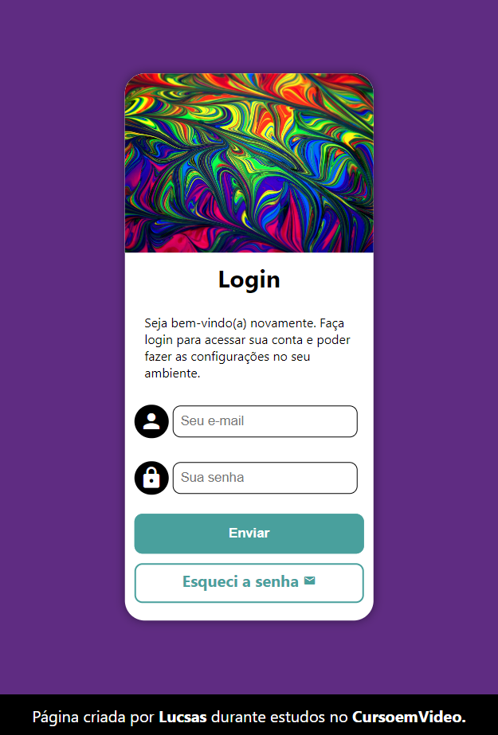
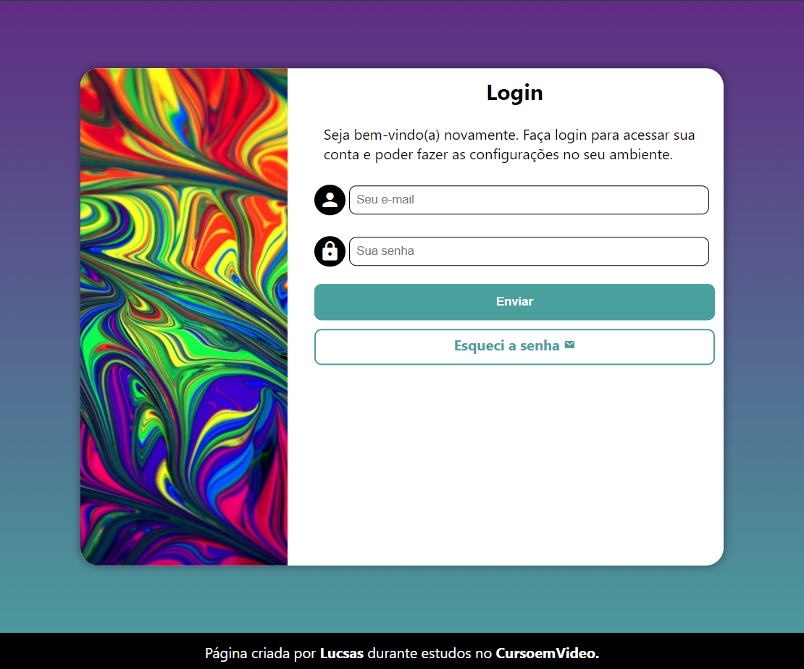
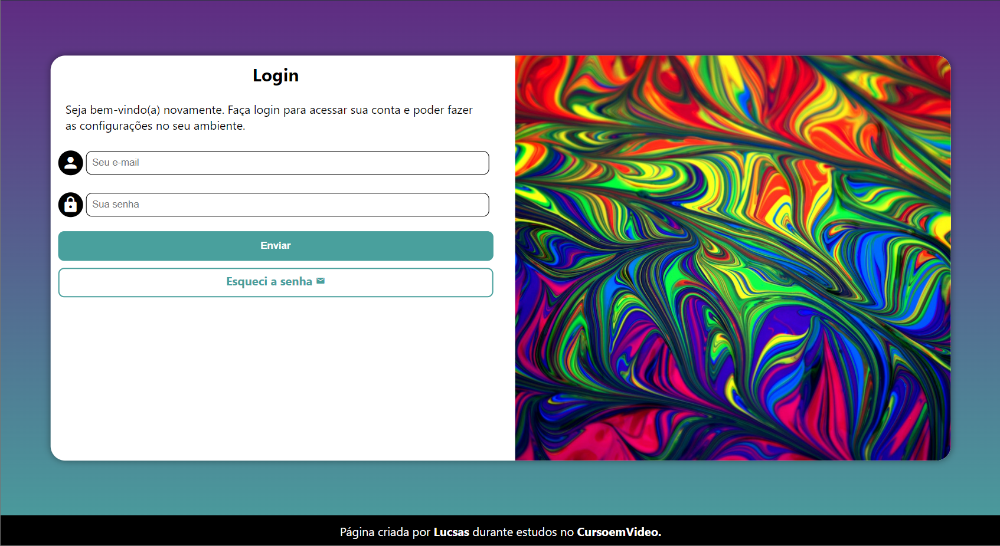

# Projeto de Login - Curso de HTML e CSS

 O projeto login foi um dos desafios propostos durante as aulas do curso de HTML e CSS do Curso em Vídeo. Desenvolvido de forma similar ao que foi apresentado nos vídeos, com pequenas diferenças no design e da imagem usada originalmente no curso.

## Conteúdo

 Neste desafio, o que foi posto em cheque foi as competências em relação a: 

- ***formulários***,*** que são usados como forma de capturação e manipulação de dados para funcionamento de sistemas e aplicações;
 
- ***Media Queries*** e ***Media Features*** que são essenciais para um dinamismo e uma portabilidade em todos os dispositivos eletrônicos;

- ***Posicionamento e organização de caixas,*** que moldam a diagramação e design do site.

 Há 4 estados em que o projeto pode aparecer, sendo eles o estado de *Smartphones* e *telas pequenas, Tablets* ou *Netbooks, Desktop* e *Telas Grandes*

 

 

 

 